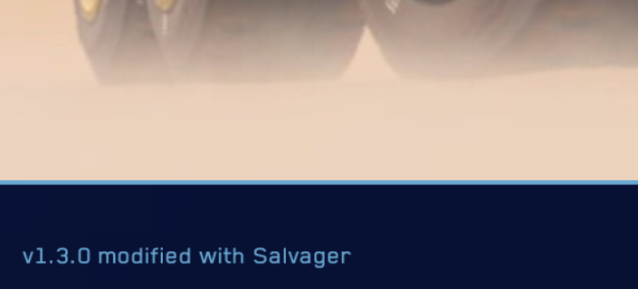

# Salvager

Code patch tool for Deserts of Kharak. Create `diff`-style patches for the game's C# code and apply them to the base game binaries to create a distributable mod.

## Requirements

- Docker
- Docker Compose
- an unmodified version of Deserts of Kharak (see [Usage](#usage) for details)

## Usage

```
./salvager.sh (-h|--help)
./salvager.sh
    (-d|--dok-managed) <dok-managed-dir>
    [(-s|--source-out) <source-out-dir>]
    [(-a|--apply-patches) <patch-dir>]
    [(-m|--modified-source) <modified-source-dir>
        [(-g|--generate-patch) <generated-patch-file>] ]
    [(-o|--artifacts-out) <artifacts-out-dir>]
```

- `-h|--help`: display command usage.
- `-d|--dok-managed <dok-managed-dir>` (required): path to the `Deserts of Kharak/Data/Managed/` folder of a fresh, unmodified installation of Deserts of Kharak.
- `-s|--source-out <source-out-dir>` (optional): path where the tool will write decompiled source files.
- `-a|--apply-patches <patch-dir>` (optional): directory containing patch files to apply on top of the decompiled source.
- `-m|--modified-source <modified-source-dir>` (optional): path to modified source files. The compiled artifacts will be built from this source instead of the decompiled and patched source.
- `-g|--generate-patch <generated-patch-file>` (optional, requires `-m|--modified-source`): output location for patch file representing changes between decompiled and modified source.
- `-o|--artifacts-out <artifacts-out-dir>` (optional): path where the tool will write recompiled assemblies.

## Example

Before you get started, make sure you have a clean Deserts of Kharak installation. An easy method is to delete the `Data/Managed/` folder in your Deserts of Kharak folder and then redownload those files with Steam (Deserts of Kharak > Properties > Local Files > Verify integrity of game files).

Once you have a clean install, make a copy of the `Data/Managed/` folder somewhere safe. Whenever you call Salvager, use this path with the `--dok-managed` option.

Now, let's build a simple mod. We can dump the decompiled source of the game:

```
$ ./salvager.sh --dok-managed /path/to/managed --source-out src/
Decompiling...
Copying sources...
```

You should now see a complete project tree in the `src` folder. Open `src/BBI.Unity.Game/Properties/AssemblyInfo.cs`. Find this line:

```csharp
[assembly: AssemblyInformationalVersion("v1.3.0")]
```

Customize the version string:

```csharp
[assembly: AssemblyInformationalVersion("v1.3.0 modified with Salvager")]
```

Now, we can compile the mod:

```
$ ./salvager.sh --dok-managed /path/to/managed --modified-source src/ --artifacts-out out/
Decompiling...
Applying modified source...
patching file src/BBI.Unity.Game/Properties/AssemblyInfo.cs
Compiling...
```

The compiler will output a large volume of warnings. When the build succeeds, the assemblies will be available in the `out` folder.

Copy `BBI.Unity.Game.dll` into the `Data/Managed/` folder of your Deserts of Kharak installation. Start the game and you will see the modified version string:



Next, we will generate a patch file containing the changes you made. This works by comparing the decompiled source of the base game with the modified source you provide:

```
$ ./salvager.sh --dok-managed /path/to/managed --modified-source src/ --generate-patch version.patch
Decompiling...
Applying modified source...
patching file src/BBI.Unity.Game/Properties/AssemblyInfo.cs
```

The `version.patch` file contains a diff with everything you changed:

```diff
diff -Naur src/BBI.Unity.Game/Properties/AssemblyInfo.cs mod/BBI.Unity.Game/Properties/AssemblyInfo.cs
--- src/BBI.Unity.Game/Properties/AssemblyInfo.cs	2022-04-24 16:49:01.703796356 +0000
+++ mod/BBI.Unity.Game/Properties/AssemblyInfo.cs	2022-04-24 16:48:39.756146005 +0000
@@ -8,7 +8,7 @@

 [assembly: ComVisible(false)]
 [assembly: AssemblyFileVersion("1.0.0.0")]
-[assembly: AssemblyInformationalVersion("v1.3.0")]
+[assembly: AssemblyInformationalVersion("v1.3.0 modified with Salvager")]
 [assembly: InternalsVisibleTo("BBI.Unity.Tests")]
 [assembly: Guid("5b5b445b-fc18-4d62-af2b-2ff78efd4b22")]
 [assembly: InternalsVisibleTo("BBI.Debugger")]
```

Move that file to a `patches` folder. Now, you can repeat the process but include `--apply-patches patches/` with every Salvager command. Every time Salvager runs, it will decompile the base game, apply all of the patches in the `patches` folder (in order by filename), dump the patched source, read your modified source, generate a patch file with the difference, and compile the final result.

## Current Limitations

- The container currently runs as root and writes files with root permissions.
- Output files and directories are created even if the tool fails before writing output.
- The decompiled `.sln` file has unstable project GUIDs, resulting in noisy patch files. These diffs can be removed from a patch as long as you aren't deliberately modifying the solution file itself.
- Option parsing in `salvager.sh` has only been tested on one platform and may not be compatible with others.
